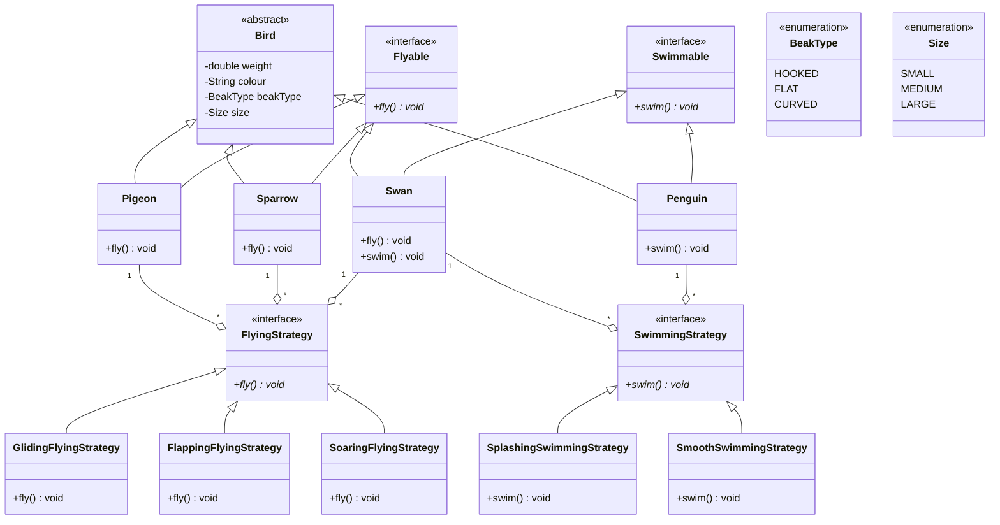

```mermaid
classDiagram
    class Bird {
        <<abstract>>
        -double weight
        -String colour
        -BeakType beakType
        -Size size
    }
    
    class Penguin {
        +swim() void
    }
    class Sparrow {
        +fly() void
    }
    class Pigeon {
        +fly() void
    }
    class Swan {
        +fly() void
        +swim() void
    }
    
    class Flyable {
        <<interface>>
        +fly()* void
    }
    
    class Swimmable {
        <<interface>>
        +swim()* void
    }
    
    class BeakType {
        <<enumeration>>
        HOOKED
        FLAT
        CURVED
    }
    class Size {
        <<enumeration>>
        SMALL
        MEDIUM
        LARGE
    }
    
    class FlyingStrategy {
        <<interface>>
        +fly()* void
    }
    
    class SwimmingStrategy {
        <<interface>>
        +swim()* void
    }
    
    class GlidingFlyingStrategy {
        +fly() void
    }
    
    class SoaringFlyingStrategy {
        +fly() void
    }
    
    class FlappingFlyingStrategy {
        +fly() void
    }
    
    class SplashingSwimmingStrategy {
        +swim() void
    }
    
    class SmoothSwimmingStrategy {
        +swim() void
    }
    
    Relationships
    
    Bird <|-- Sparrow
    Bird <|-- Pigeon
    Bird <|-- Penguin
    
    Flyable <|-- Sparrow
    Flyable <|-- Pigeon
    Flyable <|-- Swan
    Swimmable <|-- Penguin
    Swimmable <|-- Swan
    
    FlyingStrategy <|-- GlidingFlyingStrategy
    FlyingStrategy <|-- FlappingFlyingStrategy
    FlyingStrategy <|-- SoaringFlyingStrategy
    SwimmingStrategy <|-- SplashingSwimmingStrategy
    SwimmingStrategy <|-- SmoothSwimmingStrategy
    
    Pigeon "1" --o "*" FlyingStrategy
    Sparrow "1" --o "*" FlyingStrategy
     
    Swan "1" --o "*" SwimmingStrategy
    Swan "1" --o "*" FlyingStrategy
    
    Penguin "1" --o "*" SwimmingStrategy
    
    
    
    
```
