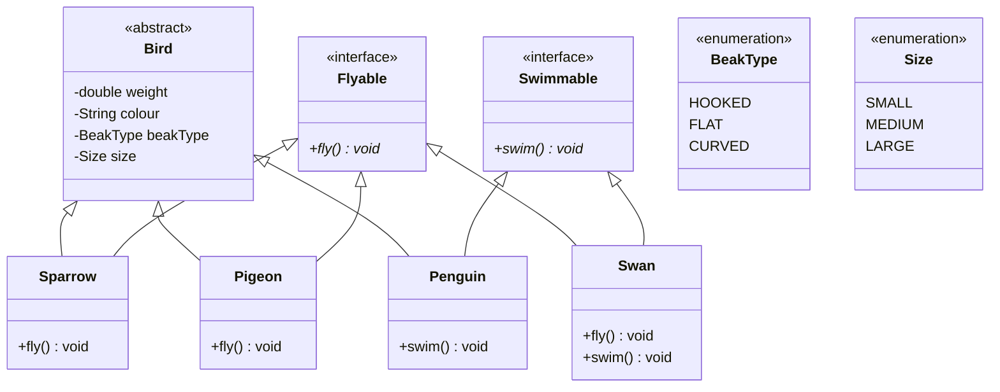

```mermaid
classDiagram
    class Bird {
        <<abstract>>
        -double weight
        -String colour
        -BeakType beakType
        -Size size
    }
    
    class Penguin {
        +swim() void
    }
    class Sparrow {
        +fly() void
    }
    class Pigeon {
        +fly() void
    }
    class Swan {
        +fly() void
        +swim() void
    }
    
    class Flyable {
        <<interface>>
        +fly()* void
    }
    
    class Swimmable {
        <<interface>>
        +swim()* void
    }
    
    class BeakType {
        <<enumeration>>
        HOOKED
        FLAT
        CURVED
    }
    class Size {
        <<enumeration>>
        SMALL
        MEDIUM
        LARGE
    }
    
    Relationships
    Bird <|-- Sparrow
    Bird <|-- Pigeon
    Bird <|-- Penguin
    Flyable <|-- Sparrow
    Flyable <|-- Pigeon
    Swimmable <|-- Penguin
    Flyable <|-- Swan
    Swimmable <|-- Swan
```
